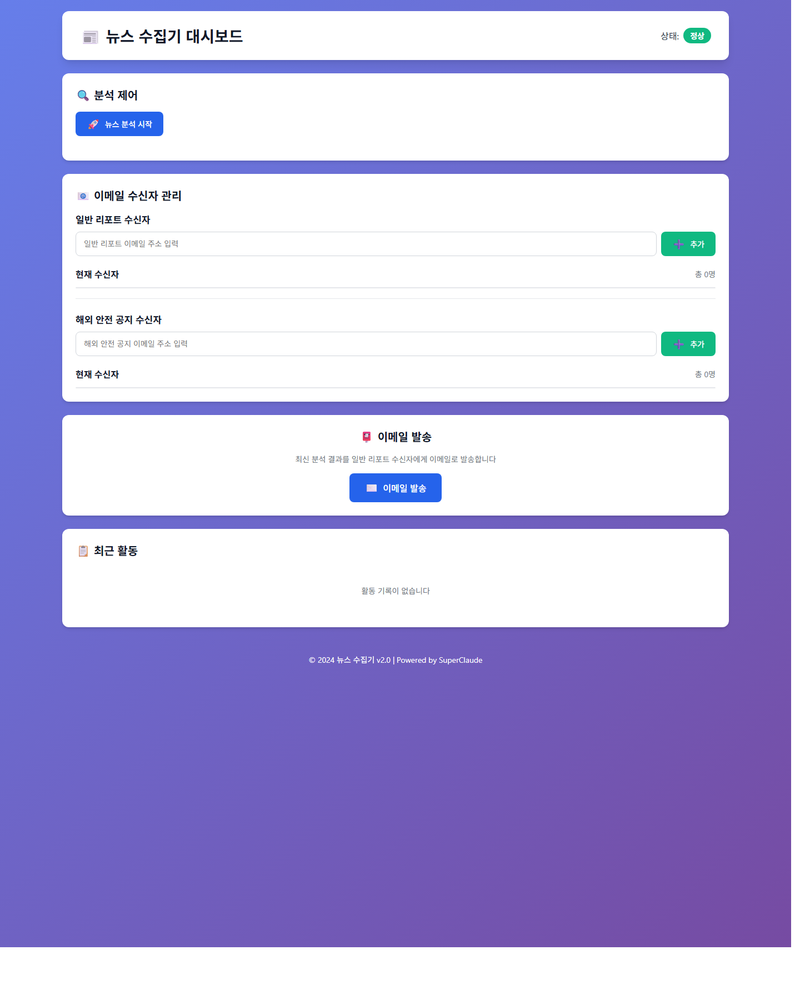
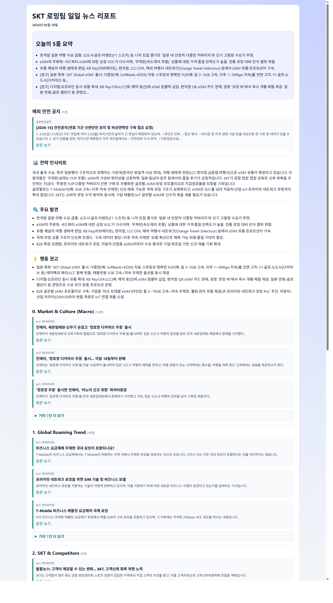

# NewsCollector v2.0

SKT 로밍팀을 위한 뉴스 수집 및 AI 분석 시스템

## 📋 개요

6개 카테고리의 기사/게시글을 자동 수집하고, AI 2단계 분석 후 결과를 웹/이메일로 배포합니다.  
추가로 외교부 0404(해외안전여행) 게시판의 당일 통신 이슈 공지도 별도 수집합니다.

## ✨ 주요 기능

- 자동 뉴스 수집
- Naver News / Blog / Cafe Search API
- Google Custom Search API
  - `Global Roaming Trend`는 Google 응답의 `pagemap.metatags`/snippet prefix에서 게시일 후보를 추출해 최신성 필터에 활용
- 0404.go.kr 공관안전공지/안전공지 당일 통신/로밍 맥락 기반 수집
- 스마트 필터링
- 시간 필터 (`TIME_WINDOW_HOURS`, 기본 24시간)
  - 월요일(KST) 실행 시: 금요일 09:00 ~ 월요일 09:00 고정 구간
- 키워드/도메인 필터 (`config/categories.yaml`)
  - `global_trend`는 전용 품질 규칙으로 social/community 도메인, help/support/faq URL, 반려동물/비통신 맥락 오탐을 추가 차단
- 중복 제거
- 카테고리 내 중복 제거: 제목 정규화 + URL
- 카테고리 간 중복 제거: URL 기준(현재는 로그/통계 용도로 수행)
- AI 2단계 분석
- STEP 1: 기사 요약 (`OPENAI_MODEL_BASIC`, 기본 `gpt-4o-mini-2024-07-18`)
  - `global_trend` 카테고리 제목/요약은 한국어로 번역 생성
- STEP 2: 전략 인사이트 생성 (`OPENAI_MODEL_ADVANCED`, 기본 `gpt-4o-mini-2024-07-18`)
- Global Roaming Trend 한글 전용 표시
  - 해당 섹션은 한글 중심으로 노출하며, 한글이 전혀 없는 영문 문장만 fallback 처리
  - 번역/후처리 결과가 완전 영문이거나 비어 있으면 한글 대체 문구로 안전 치환
  - 내부 데이터에는 `translation_status`, `translation_notes`를 남겨 번역 실패 원인을 추적 가능
- 멀티 채널 결과 생성
- 웹 리포트 HTML 생성 (`output/web/daily_report.html`)
  - 실행 시각별 이력 저장 (`output/web/history/daily_report_YYYYMMDD_HHMMSS.html`)
- 이메일 HTML 포맷 후 SMTP 발송
- 가독성 최적화 레이아웃
  - 카테고리별 핵심 `Top N` 카드 + 나머지 링크 목록으로 압축 표시
  - 요약 본문 길이 자동 절단(`EMAIL_SUMMARY_MAX_CHARS`, `WEB_SUMMARY_MAX_CHARS`)
- 해외 안전 공지 전용 알림 메일 자동 발송 (당일 공지 존재 시)
- 수신자 그룹 분리/영속화
  - 일반 리포트 수신자
  - 해외 안전 공지 수신자

## 🚀 설치

### 1. Python 설치

Python 3.9 이상 필요

```bash
python --version
```

### 2. 의존성 설치

```bash
pip install -r requirements.txt
```

코드에서 `python-dotenv`를 사용하므로 누락 시 아래도 추가 설치하세요.

```bash
pip install python-dotenv
```

### 3. 환경 변수 설정

`.env.example`을 복사하여 `.env` 생성

```bash
cp .env.example .env
```

`.env` 주요 항목:

```bash
# Naver
NAVER_CLIENT_ID=...
NAVER_CLIENT_SECRET=...

# Google CSE
GOOGLE_API_KEY=...
SEARCH_ENGINE_ID=...

# OpenAI
OPENAI_API_KEY=...
OPENAI_BASE_URL=https://api.openai.com/v1
OPENAI_MODEL_BASIC=gpt-4o-mini-2024-07-18
OPENAI_MODEL_ADVANCED=gpt-4o-mini-2024-07-18

# Gmail SMTP
GMAIL_USER=...
GMAIL_APP_PASSWORD=...

# 레거시 호환용(선택)
EMAIL_RECIPIENTS=user1@sk.com,user2@sk.com

# 옵션
DEBUG_MODE=false
TIME_WINDOW_HOURS=24
MAX_ARTICLES_PER_CATEGORY=10
EMAIL_TOP_N=3
EMAIL_SUMMARY_MAX_CHARS=140
WEB_DEFAULT_VISIBLE_N=3
WEB_SUMMARY_MAX_CHARS=180
```

- `MAX_ARTICLES_PER_CATEGORY`: 현재는 설정만 로드되며 메인 수집 루프(`main.py`)에서는 실제 제한값으로 사용하지 않는 예약 항목
- `EMAIL_TOP_N`: 메일에서 카테고리별 카드로 보여줄 핵심 기사 수
- `EMAIL_SUMMARY_MAX_CHARS`: 메일 summary 최대 길이
- `WEB_DEFAULT_VISIBLE_N`: 웹 리포트에서 기본 노출 카드 수
- `WEB_SUMMARY_MAX_CHARS`: 웹 리포트 summary 최대 길이

## 🎯 사용법

### CLI 전체 파이프라인 실행

```bash
python run.py
```

또는

```bash
python main.py
```

실행 순서:

1. 카테고리별 수집
2. 시간/키워드 필터링 + 중복 제거
3. AI 요약/인사이트 생성
4. 0404 공지 수집 (기본 당일, 월요일은 주말 확장)
5. 이메일 발송 + 웹 리포트 생성

### Shrimp Task Manager 규칙 초기화

- 본 저장소는 shrimp 프로젝트 규칙 파일을 루트의 `shrimp-rules.md`로 관리합니다.
- Codex/Claude Code에서 shrimp를 사용할 때 아래 요청으로 규칙을 초기화/갱신합니다.

```text
init project rules
```

- 태스크 계획/실행 전 `shrimp-rules.md`를 우선 참조합니다.

### 웹 대시보드 실행

```bash
python start_web.py
```

접속: [http://localhost:5000](http://localhost:5000)

## 🖼️ 실행 예시와 결과 화면

아래 예시는 저장소의 최신 산출물 기준으로 반영했습니다.

- 기준 실행일: `2026-03-19`
- 최신 리포트: `output/web/daily_report.html`
- 이력 리포트 예시: `output/web/history/daily_report_20260319_093301.html`
- 최신 로그: `output/logs/news_collector_20260319.log`

### 실행 로그 예시

```text
[2026-03-19 09:29:12] [INFO] [news_collector] Total unique articles: 157
[2026-03-19 09:29:12] [INFO] [news_collector] STEP 1: Summarizing articles with gpt-4o-mini-2024-07-18...
[2026-03-19 09:30:29] [INFO] [news_collector] STEP 2: Generating insights with gpt-4o-mini-2024-07-18...
[2026-03-19 09:33:01] [INFO] [news_collector] External alerts collected: 1
[2026-03-19 09:33:01] [INFO] [news_collector] Results saved successfully
[2026-03-19 09:33:04] [INFO] [news_collector] Safety alert email sent successfully to 4 recipients
```

### 웹 대시보드 예시

`python start_web.py` 실행 후 접속하는 관리 화면입니다. 수신자 관리, 분석 시작, 저장된 리포트 선택 기능을 제공합니다.



### 생성 결과 리포트 예시

분석 완료 후 생성되는 최신 HTML 리포트 화면입니다. 본 예시는 `output/web/daily_report.html`을 캡처한 이미지입니다.



### 0404 수집 로직 테스트

단위 테스트(권장, 오프라인):

```bash
python -m unittest tests/test_mofa_0404_collector_unit.py -v
python -m unittest tests/test_global_trend_korean_only.py -v
python -m unittest tests/test_google_collector.py -v
python -m unittest tests/test_keyword_filter.py -v
```

실사이트 스모크 테스트(선택):

```bash
# PowerShell
$env:RUN_0404_SMOKE="true"
python -m unittest tests/test_mofa_0404_collector_smoke.py -v
```

- 스모크 테스트는 외부 네트워크/사이트 상태에 따라 실패할 수 있어 기본값은 skip입니다.

## 📁 프로젝트 구조

```
NewsCollector_v2.0/
├── config/
│   ├── settings.py
│   ├── categories.yaml
│   ├── email_recipients.json
│   └── recipient_store.py
├── collectors/
├── filters/
├── analyzers/
├── notifiers/
├── utils/
├── web/
├── output/
│   ├── logs/
│   ├── web/
│   └── backups/
├── main.py
├── run.py
├── start_web.py
└── README.md
```

## 📊 카테고리

| ID | 카테고리 | 소스 |
|----|---------|------|
| 0 | Market & Culture (Macro) | Naver News, Blog |
| 1 | Global Roaming Trend | Google Search |
| 2 | SKT & Competitors | Naver News |
| 3 | eSIM Products | Naver News |
| 4 | 로밍 VoC | Naver Blog, Cafe |
| 5 | eSIM VoC | Naver Blog, Cafe |

## 🔧 설정

### 카테고리/키워드

`config/categories.yaml`의 `categories`를 수정

### 필터

`config/categories.yaml`의 `filters`:

- `blacklist_domains`
- `excluded_keywords`
- `global_trend.excluded_domains`
- `global_trend.excluded_url_patterns`
- `global_trend.excluded_keywords`
- `global_trend.required_keywords`

### Global Roaming Trend 품질 기준

- Google 검색 결과의 `article:published_time`, `og:published_time`, `parsely-pub-date`, snippet 앞 날짜(`Mar 30, 2026 ...`)를 우선 추출해 `published`에 반영합니다.
- `published` 추출 실패 시에도 `published_raw`, `freshness_source`, `source_domain`, `query`, `quality_flags`를 결과에 남겨 후속 필터와 디버깅에 사용합니다.
- `global_trend`는 일반 필터 외에 전용 품질 규칙을 적용합니다.
  - `facebook.com/groups/...` 같은 social/community 결과 제외
  - `/support/`, `/help/`, `/faq` 등 정적 요금/안내 페이지 제외
  - `dog`, `pet`, `neighborhood` 등 로밍 산업과 무관한 맥락 제외
  - `roaming`, `eSIM`, `connectivity`, `telecom`, `network`, `MVNO`, `satellite` 등 통신/연결성 키워드가 없는 결과 제외
- 번역 후처리는 title/summary 문자열을 항상 유지하면서 내부적으로 `translation_status`를 기록합니다.
  - `translated`: 한글 결과 유지
  - `partial_fallback`: 제목 또는 요약 한쪽만 fallback
  - `full_fallback`: 제목/요약 모두 fallback
- 현재 notifier는 기존 호환성을 위해 카드에는 title/summary만 출력하고, 번역 상태 메타는 내부 검증/디버깅용으로 유지합니다.

## 🌐 웹 대시보드 상세

### 기능

- 분석 비동기 실행(백그라운드 스레드)
- 진행률 표시(0→10→50→80→100)
- 수신자 그룹별 추가/삭제
  - 일반 리포트 수신자
  - 해외 안전 공지 수신자
- 최신 리포트 열기
- 저장된 리포트 목록 조회/선택 열기
- 최신 HTML 리포트 이메일 발송(일반 리포트 수신자 대상)
- 분석 완료 후 해외 안전 공지 존재 시 전용 알림 메일 자동 발송

### 주요 API

- `POST /api/analysis/start`
- `GET /api/analysis/status/<task_id>`
- `GET /api/recipients?group=report|safety_alert`
- `POST /api/recipients?group=report|safety_alert`
- `DELETE /api/recipients/<email>?group=report|safety_alert`
- `POST /api/email/send`
- `GET /api/latest-report`
- `GET /api/reports?limit=30`
- `GET /health`

## 📧 수신자 관리 방식 (중요)

- CLI(`main.py`)와 웹 대시보드 모두 `config/email_recipients.json`을 공통 사용
- 수신자 그룹:
  - `report_recipients`: 일반 리포트 메일 수신자
  - `safety_alert_recipients`: 해외 안전 공지 전용 메일 수신자
- 수신자 변경사항은 파일에 즉시 저장되어 재시작 후에도 유지

## 🛰️ 0404 외부 공지 수집

- 대상 게시판: 공관안전공지(`embsyNtc`), 안전공지(`safetyNtc`)
- 기준 날짜:
  - 기본: KST(Asia/Seoul) 당일
  - 월요일(KST) 실행 시: 금요일 09:00 ~ 월요일 09:00 구간을 날짜 기준으로 확장 수집
- 날짜 처리 방식:
  - 0404 수집은 `YYYY-MM-DD` 일 단위 범위로 필터링합니다.
  - 수집 결과의 `published_date`는 실제 게시판 목록에 표시된 게시일입니다.
- 강한 키워드: 로밍/eSIM/유심/SIM/데이터 로밍/국제전화/SMS/MMS
- 문맥 키워드: 통신/통신망/인터넷/데이터/문자/네트워크 중심으로 제한합니다.
- 장애 키워드: 장애/불가/제한/중단/지연/오류/마비/수신 불가/접속 불가 등 실제 서비스 영향 표현만 사용합니다.
- 제외 문맥: `통신 보안`, 반군, 화산/가스, `공기 유입 차단`, `출입 제한`, `긴급전화`, `연락두절`, 리플릿/체류정보/대비요령 같은 일반 안내 문구는 제외합니다.
- 매칭 규칙:
  - 제목만으로 매칭하려면 로밍/데이터/SMS/MMS/국제전화 등 서비스 키워드와 장애 표현이 함께 있어야 합니다.
  - 본문 매칭은 같은 문장 안에 서비스 키워드와 실제 장애 표현이 함께 있고, 현재성 있는 장애 문맥일 때만 허용합니다.
  - `가능성`, `참고`, 리플릿/체류정보/대비요령 같은 상시 안내 문구는 통신 관련 문장이 있어도 제외합니다.
  - 군사적 긴장/공격 위협 공지라도 통신 서비스 장애 또는 비상 연락 대체수단 안내가 실제 문장 단위로 확인되면 수집 대상이 될 수 있습니다.
  - 목적은 로밍팀이 바로 대응할 필요가 있는 실제 통신 서비스 제한 공지만 남기는 것입니다.
- 결과는 `external_alerts`로 리포트 상단 섹션에 포함
  - `external_alerts[].published_date`: 0404 게시판의 실제 게시일(`YYYY-MM-DD`)
  - `external_alerts[].match_reason`, `external_alerts[].matched_keywords`, `external_alerts[].matched_excerpt`를 함께 포함
- 해외 안전 공지 수집 건수 > 0 이면 전용 수신자에게 별도 알림 메일 자동 발송

### 0404 수집 단위 테스트 실행

```bash
python -m unittest tests/test_mofa_0404_collector.py -v
python -m unittest tests/test_mofa_0404_collector_unit.py -v
```

- 외부 사이트 접속 없이(mock 기반) 공관안전공지 수집 로직과 0404 오탐 회귀 케이스를 검증합니다.

## ⚠️ 에러 핸들링/재시도

- AI 호출: 최대 3회 재시도(지수 백오프)
- SMTP 발송: 최대 3회 재시도
- 이메일 발송 실패 시: `output/backups/email_backup_*.html` 저장
- 수집 API 실패 시: 로깅 후 가능한 범위 내 계속 진행

## 📝 로그/출력

- 로그: `output/logs/news_collector_YYYYMMDD.log`
- 웹 리포트(최신): `output/web/daily_report.html`
- 웹 리포트(이력): `output/web/history/daily_report_YYYYMMDD_HHMMSS.html`
- 이메일 실패 백업: `output/backups/*.html`

## 📄 라이선스

SKT 내부 사용용

## 📞 지원

문제 발생 시 `output/logs/` 확인

---

**버전**: 2.0  
**최종 업데이트**: 2026-03-31
## 최근 수정 메모

- `README.md`를 현재 코드/출력 기준으로 재검토하고, 최신 실행 예시와 결과 화면 캡처(`docs/images/*.png`)를 반영했습니다.
- `.env` 예시의 `MAX_ARTICLES_PER_CATEGORY`는 현재 메인 수집 루프에서 실제 사용되지 않는 예약 항목임을 명시했습니다.
- `notifiers/web_generator.py`의 외부 공지 섹션 렌더링에서 정의되지 않은 `category_key`
  참조를 제거해 `name 'category_key' is not defined` 예외를 수정했습니다.
- 회귀 확인은 `python -m unittest tests/test_global_trend_korean_only.py -v`로 수행할 수 있습니다.
- `Global Roaming Trend` 수집은 Google 결과 메타/스니펫에서 게시일을 추출하고, `config/categories.yaml`의 전용 품질 규칙으로 social/help/반려동물 오탐을 줄이도록 보강했습니다.
- 번역 후처리에 `translation_status`, `translation_notes`를 추가해 fallback 발생 원인을 내부적으로 추적할 수 있게 했습니다.
- 관련 회귀 테스트는 `python -m unittest tests/test_google_collector.py -v`, `python -m unittest tests/test_keyword_filter.py -v`, `python -m unittest tests/test_global_trend_korean_only.py -v`로 확인할 수 있습니다.
